# Introduction
Much progress in the field of Computer Vision has been made in terms of models, methods, and optimization. However, one area which necessitates further improvement is data (both quality and quanitity). What if we could generate infinite data? Can we train any machine learning model then? In a classic document titled ["The Unreasonable Effectiveness of Data"](https://static.googleusercontent.com/media/research.google.com/en//pubs/archive/35179.pdf), AI legend Peter Norvig and colleagues suggest that data might be able to solve all problems that involve human beings. While physics can explain the real world, humans remain an enigma that only the promise of infinite data might be able to solve (allegedly).

For the scope of this project, we choose to concentrate on Unmanned Aerial Vehicle (UAV) data. UAVs have stringent safety requirements because they operate at a variety of speeds, altitudes, and environments. Autonomous control systems, such as self-driving vars, need thousands or even millions of training examples to ensure quality - UAV datasets are contrastingly scarce and expensive to annotate. This leads us to explore the efficacy and bounds of data generation.

Is there a limit to how much data we can generate and leverage? What are the challenges? How can we solve them? 

Using [Conditional Generative Adversarial Networks](https://arxiv.org/pdf/1411.1784.pdf) with [Unreal Engine](https://www.unrealengine.com) there is a way to at least partially answer these questions. That is the topic of contention in this project. We explore the limits of roughly the following process:
1. Generate data using Unreal Engine
2. Translate this data into real world data using Conditional Adversarial Networks (e.g. [Image-To-Image Translation with Conditional Adversarial Networks](https://arxiv.org/pdf/1611.07004.pdf))
3. Train a deep neural network on this generated data

# Approach

We begin by [defining a generative model for synthetic data using the Unreal Engine](#programmable-generative-model-for-synthetic-data-unreal-engine).

## Programmable Generative Model for Synthetic Data: Unreal Engine
The Unreal Engine provides us with a programmable environment. For programming this environment, we develop a very simple library called [unreal-cv-data](https://github.com/abhay-venkatesh/unreal-cv-data) that is built on [UnrealCV](https://github.com/unrealcv/unrealcv). Using this library is very simple: 
1. download [Unreal Engine](https://www.unrealengine.com)
2. install [UnrealCV](https://github.com/unrealcv/unrealcv) and [unreal-cv-data](https://github.com/abhay-venkatesh/unreal-cv-data), and 
3. interface with it in the following manner:

```Python
def collect(self):
  client.connect()
  if not client.isconnected():
    raise RuntimeError("Could not connect to client. ")

  # First we prepare the Unreal Engine environment by preprocessing it
  PreProcessor(self.environment_folder).preprocess()

  # Then we build our dataset
  Builder(self.environment_folder).build(4000)

  client.disconnect()
```

### Examples
<p float="left">
  
   
  
   
</p>

<p float="left">
  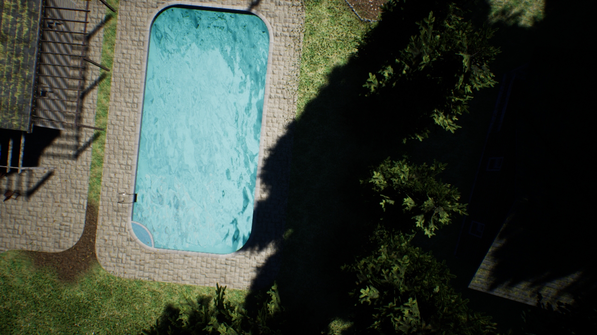
  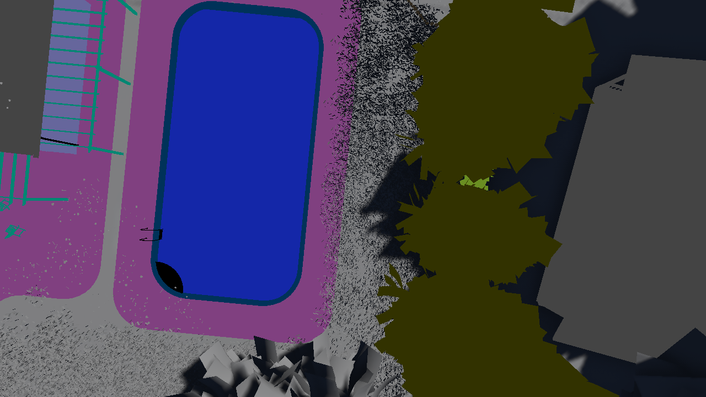 
  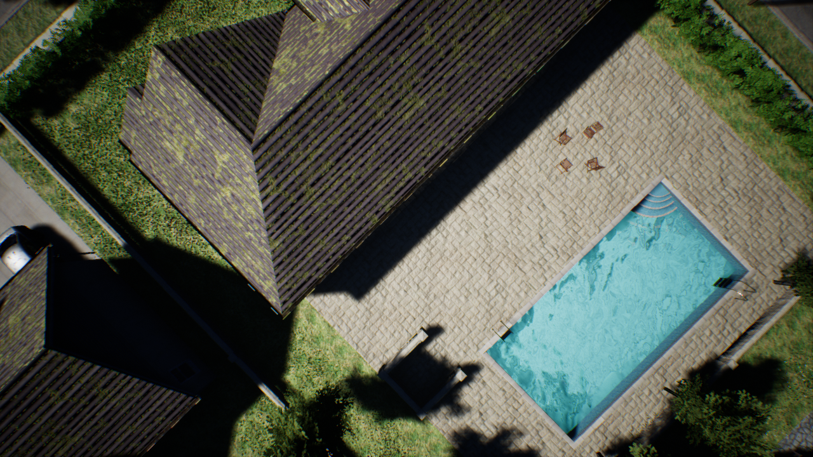
  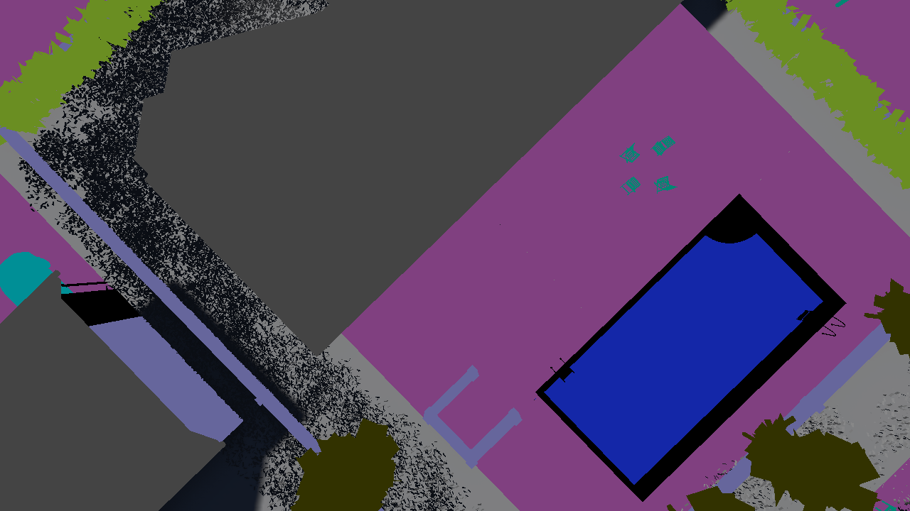 
</p>

## Data Engineering
We select the following classes and colors:
```json
{
    "paved-area": "(R=128,G=64,B=128,A=255)",
    "rocks": "(R=48,G=41,B=30,A=255)",
    "pool": "(R=0,G=50,B=89,A=255)",
    "water": "(R=28,G=42,B=168,A=255)",
    "vegetation": "(R=107,G=142,B=35,A=255)",
    "roof": "(R=70,G=70,B=70,A=255)",
    "wall": "(R=102,G=102,B=156,A=255)",
    "fence": "(R=190,G=153,B=153,A=255)",
    "car": "(R=9,G=143,B=150,A=255)",
    "tree": "(R=51,G=51,B=0,A=255)",
    "obstacle": "(R=2,G=135,B=115,A=255)"
}
```

Additionally, we have the class "grass" set to (R=0,G=102,B=0,A=255). Hence, we work with a total of 12 classes. The [ICG dataset](https://www.tugraz.at/index.php?id=22387) comes with 24 classes, 12 of which we "turn off" by [setting](https://github.com/abhay-venkatesh/conditional-drones/tree/master/icg_dataset) them to (R=0,G=0,B=0,A=0).

## Image-to-Image Translation
Let us call the Unreal Engine generative model distributions for images $$\mathbb{P}_{\text{Unreal}}(X)$$, and for their masks, $$\mathbb{P}_{\text{Unreal}}(Y)$$. 

Then, we consider a conditional generative adversarial network $$G: Y\times Z \rightarrow X$$, where $$Z\sim \mathcal{N}(\mu,\sigma)$$ is some random noise vector. This cGAN essentially takes a mask and noise vector, and translates back into a fully formed image. Our idea is to train $$G$$ using $$(Y,X)$$ pairs received from the [ICG dataset](https://www.tugraz.at/index.php?id=22387), which is a real world drone dataset. Here, each $$Y$$ is a mask, and $$X$$ is an image. The cGAN will learn to map masks into real images. 

Once we have $$G$$, we can use it to translate a $$Y\sim\mathbb{P}_{\text{Unreal}}(Y)$$ into a real-world looking image. 


### Generative Model Diversity

Furthermore, we aim to study the effects of generative model diversity on the extension of a model. Is there ways to improve a generative model such that a supervised classifier can be better learned? Our point of departure is [Image-To-Image Translation with Conditional Adversarial Networks](https://arxiv.org/pdf/1611.07004.pdf). However, we also explore other approaches such as [BicycleGAN](https://junyanz.github.io/BicycleGAN/), [SPADE](https://nvlabs.github.io/SPADE/), and an ensemble of these.


# Evaluation

## Image-To-Image Translation between Unreal and ICG

Here we use the real-world [ICG dataset](https://www.tugraz.at/index.php?id=22387) as a baseline for realistic images. The 1st and 4th columns represent segmentation masks, 2nd and 5th represent translated images, and 3rd and 6th represent the target image (either from ICG or Unreal).

### ICG Baseline
<p float="left">
  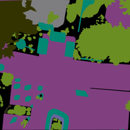
  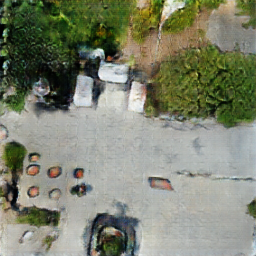
  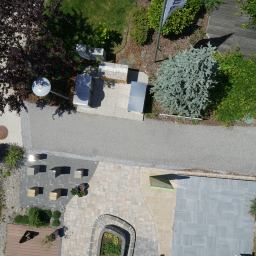
  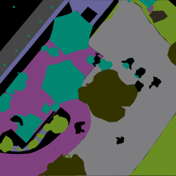
  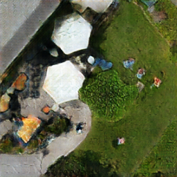
  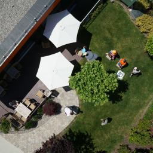
</p>
<p float="left">
  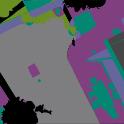
  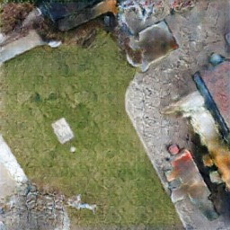
  
  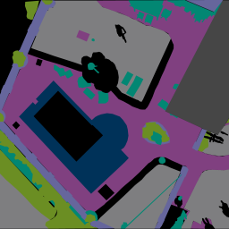
  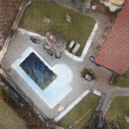
  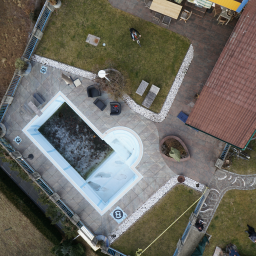
</p>

### Testing on Unreal
<p float="left">
  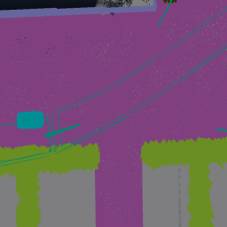
  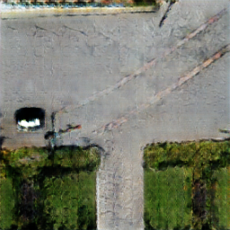
  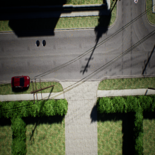
  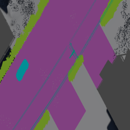
  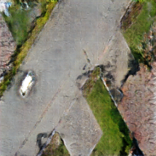
  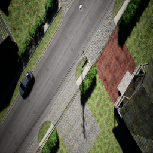
</p>

<p float="left">
  
  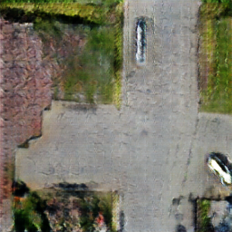
  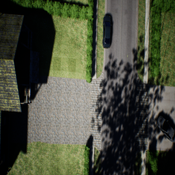
  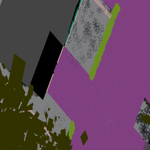
  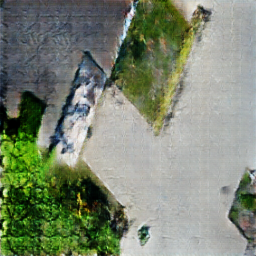
  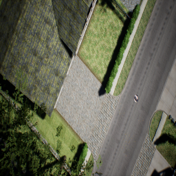
</p>

We note that we get plausible but not yet perfect results. One of the challenges that remains for us is that we cannot find a perfect 1-1 mapping between classes in the source image, and in the unreal environment. However, this is something that is entirely fixable. The unreal environment can in principle have any class, and it is now known to have [photorealistic imagery](https://www.youtube.com/watch?v=E3LtFrMAvQ4). Our intuition is that some work on the data engineering side would greatly improve our results.

## Object Detection
To evaluate our setup, we train object-detection classification models under three scenarios:
1. Train object detection models on both real and translated data, then evaluate on real data
2. Train object detection models on both real and translated data, then evaluate on translated data
3. Train object detection models on both translated and synthetic data, then evaluate on real data

We explore the [YOLO9000: Better, Faster, Stronger](https://arxiv.org/abs/1612.08242) architecture for object detection both for its simplicity and training speed. Additionally, we restrict the target classes to well-defined objects: car, roof, and tree. All other classes (grass, water, pavement, etc.) are treated as background. Evaluation metrics include Intersection over Union (IOU, or Jaccard Index of bounding box pixels) and mean average precision (mAP).

The following table summarizes performance results of scenarios 1 and 2:


We present a sample of the predicted bounding boxes derived from the models on the real ICG dataset below.

<p float="left">
  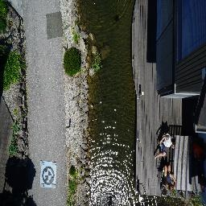
  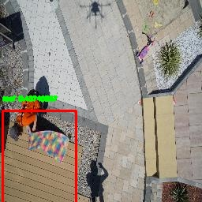
  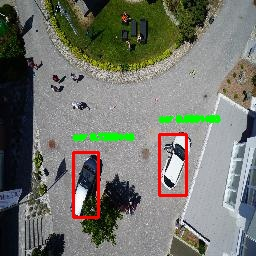
  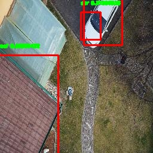
</p>

<p float="left">
  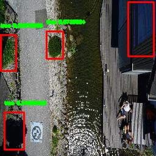
  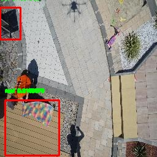
  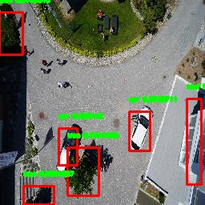
  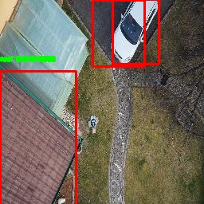
</p>

We similarly summarize performance results of scenario 3:


with an identical sample of predicted bounding boxes when trained on synthetic data.

<p float="left">
  
  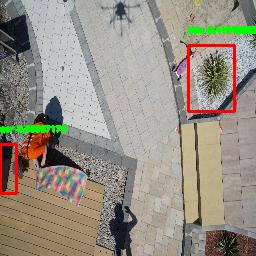
  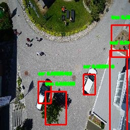
  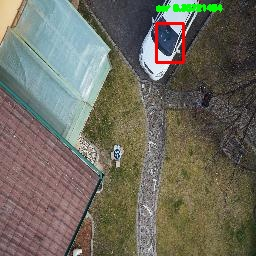
</p>

The following conclusions are derived upon analysis of these results:
* The ICG dataset size is limiting, both as a source for data generation and evaluation
* The classifier trained on translated data performs comparably to the one trained on real data, suggesting that a large quantity of translated data could suffice as substitute for a small amount of real data.
* The classifier trained on real data performs expectedly better when evaluated on real data, but still exhibits reasonable average IOU.
* The classifier trained on translated data outperforms that which was trained on purely synthetic data.

Full prediction results can be found [here](./img/object-detection).

## Stuff Segmentation

We observe that our generative model produces accurate "stuff" as in paved area or grass. Thus, we further evaluate our framework by studying stuff segmentation using synthetic data. Specifically, we use the [SegNet](http://mi.eng.cam.ac.uk/projects/segnet/) segmentation model to qualitatively assess the validity of our generated images. The following is a sample of segmentation masks comparing baseline (ICG) and generated images.


While the masks derived from generated images clearly exhibit more noise, they are similar in terms of quality to the masks derived from real images.

# Future Work

This work serves as a proof-of-concept that realistic data generation is viable, but further advancements need to be made before this data can be used as a training source for UAVs. Specifically, we outline the goals:
* Evaluate on various translated dataset sizes to explore efficacy of model by increasing data
* Generate and test using different/larger real datasets as they become available
  * requires expensive and time-intensive annotations
* Improve quality of synthetic data
  * requires unbounded data engineering efforts

# Acknowledgements
For detailed contribution information, please take a look at our [contributions
page](./pages/contributions.md). For this information in compressed form, you might in interested in our [slides](https://1drv.ms/p/s!AtPvTi3xJ45gkSpDE7SmdausqQzx).
