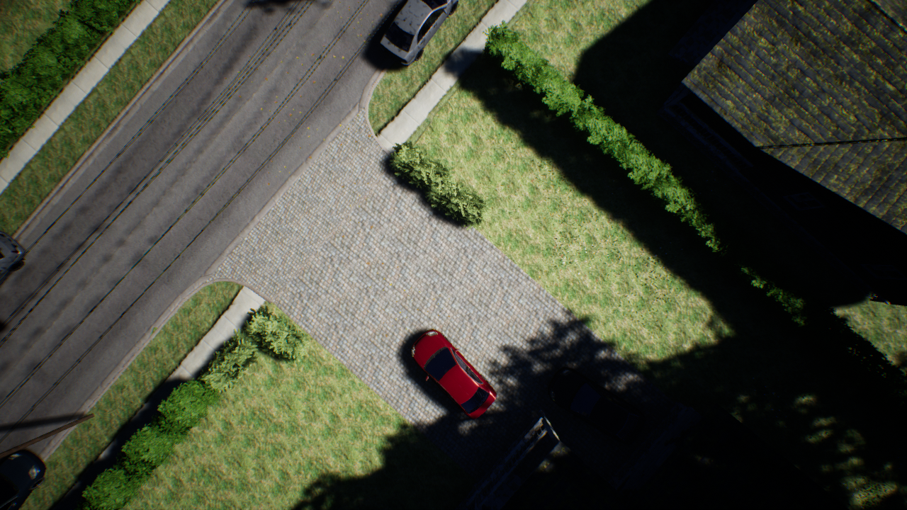
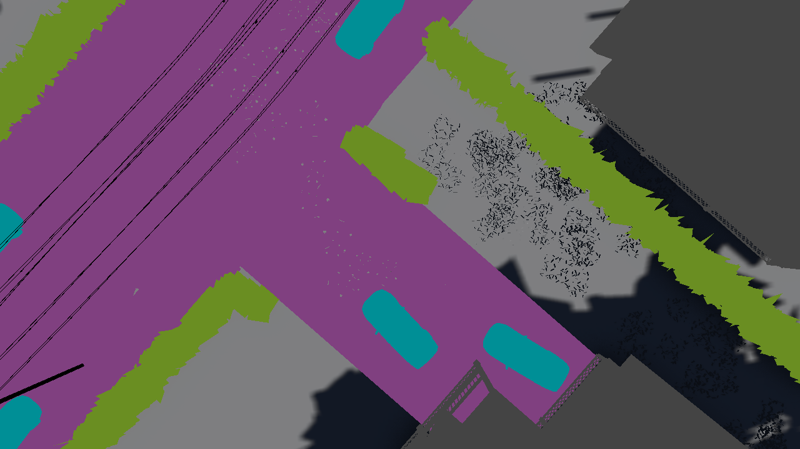
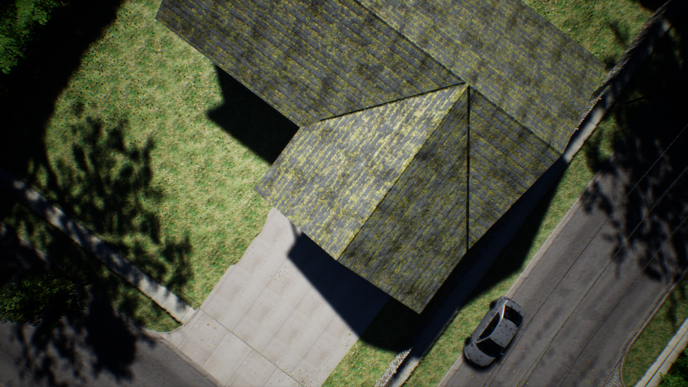
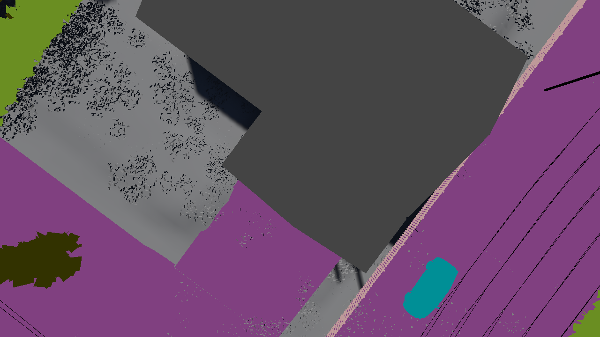

# Introduction
What if we could generate infinite data? Can we train any machine learning model then? In a classic document titled ["The Unreasonable Effectiveness of Data"](https://static.googleusercontent.com/media/research.google.com/en//pubs/archive/35179.pdf), AI legend Peter Norvig and colleagues suggest that data might be able to solve all problems that involve human beings. While physics can explain the real world; humans remain an enigma that only the promise of infinite data might be able to solve (allegedly).

Using [Conditional Generative Adversarial Networks](https://arxiv.org/pdf/1411.1784.pdf) with [Unreal Engine](https://www.unrealengine.com) there is a way to at least partially answer this question. That is the topic of contention in this project. We explore the limits of roughly the following process:
1. Generate data using Unreal Engine
2. Translate this data into real world data using Conditional Adversarial Networks (e.g. [Image-To-Image Translation with Conditional Adversarial Networks](https://arxiv.org/pdf/1611.07004.pdf))
3. Train a deep neural network on this generated data

Is there a limit to how much data we can generate? What are the challenges? How can we solve them? 

## Programmable Generative Model for Synthetic Data: Unreal Engine
The Unreal Engine provides us with a programmable environment. For programming this environment, we develop a very simple library called [unreal-cv-data](https://github.com/abhay-venkatesh/unreal-cv-data) that is built on [UnrealCV](https://github.com/unrealcv). Using this library is very simple: 1. download Unreal Engine 2. install the library, and 3. interface with it in the following manner:
```Python
def collect(self):
  client.connect()
  if not client.isconnected():
    raise RuntimeError("Could not connect to client. ")

  # First we prepare the Unreal Engine environment by preprocessing it
  PreProcessor(self.environment_folder).preprocess()

  # Then we build our dataset
  Builder(self.environment_folder).build(4000)

  client.disconnect()
```
<p float="left">
  
   
  
   
</p>


## Classes
```json
{
   "paved-area": "(R=0,G=255,B=255,A=255)",
   "window": "(R=191,G=255,B=63,A=255)",
   "wall": "(R=191,G=63,B=255,A=255)",
   "roof": "(R=0,G=63,B=31,A=255)",
   "vegetation": "(R=63,G=31,B=127,A=255)",
   "pool": "(R=0,G=255,B=95,A=255)",
   "door": "(R=127,G=95,B=255,A=255)",
   "tree": "(R=95,G=191,B=95,A=255)",
   "car": "(R=63,G=47,B=127,A=255)",
   "fence": "(R=127,G=255,B=111,A=255)",
   "rocks": "(R=159,G=255,B=111,A=255)"
}
```
